# CuBind

Place Cu(I) or Cu(II) into histidine coordination sites in a PDB file. Cu position is estimated geometrically — **structure optimisation should be performed after placement** before any MD or QM/MM use.



---

## Dependencies

```
numpy  scipy
```

## Usage

```bash
python3 CuBind_F.py protein.pdb -1   # Cu(I)  · 2×His
python3 CuBind_F.py protein.pdb -2   # Cu(II) · 3×His
```

Output: `<stem>_1Cu.pdb` / `<stem>_2Cu.pdb`

### Parameters

| Flag | Default | Description |
|------|---------|-------------|
| `--cu-n-ideal` | 2.00 Å | Target Cu–N bond length |
| `--cu-n-max` | 2.60 Å | Max accepted Cu–N distance |
| `--don-cutoff` | 7.00 Å | Max donor–donor distance |
| `--cu-sep` | 5.00 Å | Min Cu–Cu separation |
| `--clash` | 1.80 Å | Min Cu–heavy atom distance |

---

## Limitations

- **Cu only** — no Zn, Fe, or other metals
- **His-N donors only** — HIE→ND1, HID→NE2; HIP skipped
- Cu position is a geometric estimate; **run energy minimisation before downstream use**
- No water or non-His ligands considered

---

## License

MIT
